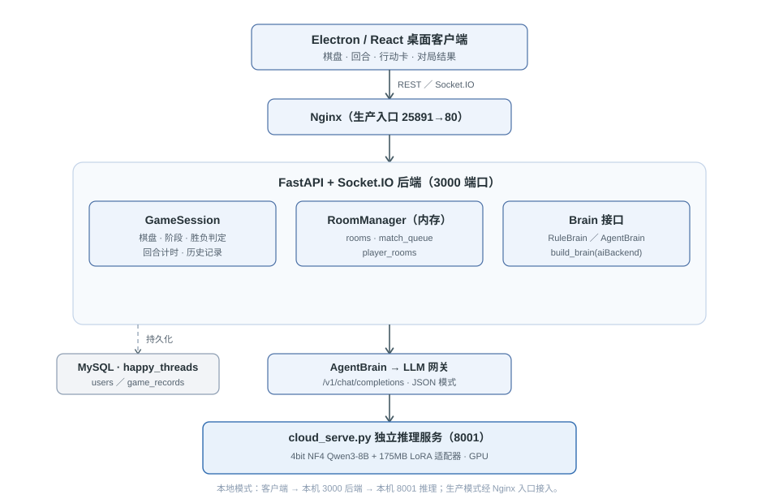
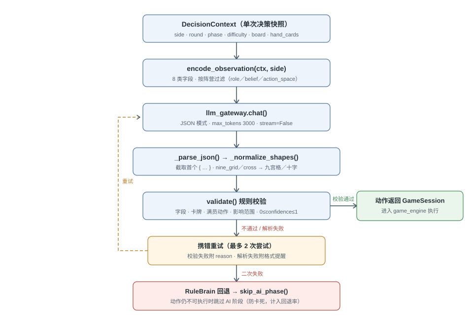
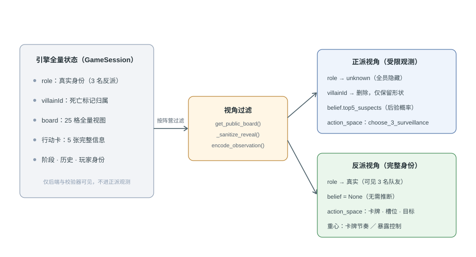

# 第三章 需求分析与总体设计

《幸せの糸》智能体系统需要把大语言模型生成的不确定文本转换为游戏引擎能够执行的确定动作。系统面对的不是单轮问答，而是最长 6 回合的连续对局：正派每轮选择 3 个监视目标，反派从 5 张行动卡中选择可用卡并放置死亡标记，任一非法字段都可能使状态机无法继续。因此，本章从需求、规则、信息边界、智能体决策链路、系统结构和部署方式 6 个方面说明总体设计，具体实现以 `backend-python/` 和根目录 `docker-compose.yml` 为依据。

图3-1 系统总体结构（Electron/React 客户端 · Nginx · FastAPI 与 Socket.IO 后端 · 智能体层 · 独立推理服务 · MySQL）

## 3.1 系统需求分析

### 3.1.1 AI 原生玩法需求

本系统的核心需求是让模型实际参与每个 AI 回合，而不是只生成角色台词或对固定规则结果进行解释。`agents/brain.py` 定义了统一的 `Brain` 协议，正派通过 `good_decision(ctx)`返回 3 个监视目标，反派通过 `evil_decision(ctx)`返回行动卡和死亡标记方案。`build_brain()`根据房间字段 `aiBackend` 构建大脑实例：`rule` 对应 `RuleBrain`，`agent` 与 `hybrid` 当前都对应 `AgentBrain`。这种接口使规则基线和 LLM 智能体能够接入同一个 `GameSession`，同时避免把两类决策逻辑写进游戏规则引擎。

“AI 即玩法”在正常执行路径中表现为 3 个步骤：`GameSession`生成决策上下文，`AgentBrain`调用模型产生候选动作，游戏引擎校验并执行动作。规则脚本不预先替模型选择行动；只有 LLM 请求、JSON 解析或规则校验连续失败时，系统才调用 `RuleBrain`保证对局继续。项目评测曾发生 2 次兜底规则成绩混入模型成绩的事故，因此回退必须作为异常路径单独计数，不能把规则脑输出记作模型自主能力。

### 3.1.2 功能需求

系统功能分为账号、房间、对局和展示 4 组。`main.py`将 FastAPI 路由与 Socket.IO 服务合并为一个 ASGI 应用，账号接口负责注册、登录和 JWT 身份验证，房间接口支持 `single`、`match`、`invite` 3 种模式。`POST /api/room/create`接收 `mode`、`aiDifficulty`、`role`、`aiBackend` 和 `revive403`，其中 `role`可以取 `good`、`evil` 或 `random`，创建成功后返回 `roomId`、`myRole` 和首个可见状态。

对局功能由 `GameSession`管理，内容包括正派监视、反派行动卡、阶段推进、公示结算、胜负判定和历史记录。`get_state(viewer_role)`返回 `round`、`phase`、`board`、`usedCards`、`winner` 和 `roundRecords` 等字段，Socket.IO 再通过 `game:state`向不同阵营分别发送视图。双人模式还设置 300s 操作倒计时和 60s 断线恢复时间；单人模式由 `auto_advance_loop()`在真人动作、AI动作和自动结算之间持续推进。

### 3.1.3 非功能需求

第一项非功能需求是可控性。正派不应接触反派身份，模型输出也不能直接修改棋盘；所有动作必须先通过 `validator.py`和 `game_engine.py`的规则检查。第二项是可恢复性，单次 LLM 决策最多尝试 2 次，两次失败后进入规则回退，`auto_advance_loop()`还设置 `max_steps=40` 防止异常状态无限推进。第三项是服务可用性，耗时 2～3min 的本地模型调用通过 `asyncio.to_thread()`移出事件循环，避免 AI 推理期间阻塞 REST 和 Socket.IO 请求。

第四项需求是有限硬件部署。实测的 Qwen3-8B 以 4bit 形式运行在 RTX 4060 Laptop 8GB 上，推理服务约 40s 就绪；桌面版完整对局中，单步决策耗时为 183.0s，重复测试为 189.8s。相同模型在云端 RTX 4090 上的决策 P50 为 12.4～14.8s，本机约慢 12 倍。因此，总体设计首先保证 8GB 显存下功能完整，再把分钟级延迟明确列为当前边界，不能把“可以运行”表述为“已经达到实时交互”。

图3-2 LLM 智能体决策流程（DecisionContext → 观测编码 → LLM 网关 → JSON 解析与校验 → 携错重试 → RuleBrain 回退与阶段跳过保护）

## 3.2 玩法规则与信息边界设计

### 3.2.1 棋盘、角色与行动卡

`create_initial_board()`创建 5×5 棋盘，共 25 个角色位置，角色编号从 201～605 映射到行列坐标。默认规则中 403 的状态为 `default_dead`，其余有效位置由 `draw_villains()`随机抽取 3 名反派；当房间参数 `revive403=True` 时，403 恢复存活并进入反派候选池。每个棋盘对象保存 `id`、`row`、`col`、`role`、`status`、监视状态和死亡标记状态，这些字段共同构成引擎内部全量状态。

反派共有 5 张行动卡，卡面由 `ACTION_CARD_POOL`固定定义：2 张同形状卡、2 张“十字+九宫格”混合卡和 1 张包含 3 次行动的卡。九宫格覆盖目标周围最多 3×3 的区域，十字覆盖目标所在行与列；执行死亡标记时，行动反派必须位于目标标记形状的影响范围内，且不能标记自己、反派同伙、已标记角色或非存活目标。行动卡每张只能使用 1 次，这些确定性约束由游戏引擎执行，而不是交给语言模型自行解释。

### 3.2.2 回合状态与胜负条件

`Phase`定义 `placement`、`action`、`reveal` 和 `gameover` 4 种阶段。第 1 回合跳过正派监视，直接从反派行动开始；第 2～5 回合依次执行正派监视、反派行动和公示结算；第 6 回合的正派监视结束后直接进入 `reveal`，不再给反派新增行动机会。正派在 `placement` 阶段必须选择 3 个互异、存活且未带死亡标记的目标，反派在 `action` 阶段则必须满足“满员行动”，即动作数恰好等于卡牌动作数与当前可行动反派数的较小值。

胜负由 `check_win_condition()`统一判定。反派处于死亡状态、带有死亡标记或当轮受到有效监视时，`_is_incapacitated()`将其视为失去行动能力；3 名反派全部失去行动能力时，正派立即获胜。若第 6 回合进入公示结算后仍存在至少 1 名可行动反派，则反派获胜。这一判定说明正派目标并非永久揭示身份，而是在有限回合内利用监视与已有标记同时限制全部反派。

### 3.2.3 阵营信息边界

同一份引擎状态必须按阵营生成不同视图。`get_public_board(board, 'good')`把正派所见角色的 `role`全部设置为 `unknown`；`GameSession._sanitize_reveal()`还会从正派收到的死亡标记中删除 `villainId`，只保留目标、形状和公开影响范围。反派视角则能够看到真实角色身份，`get_state('evil')`还会返回 3 名反派编号。信息过滤发生在后端和观测编码两个位置，即使前端未显示隐藏字段，接口层也不会把它们发送给正派。

`agents/state_encoder.py`再次按照阵营过滤模型观测。正派只能根据公开棋盘、历史死亡标记和 `belief.top5_suspects`推断反派；反派可以利用完整身份选择行动者和目标。该差异使双方对同一位置具有不同策略价值，也解释了为什么模型能力必须分角色评价：实测 Qwen3-8B 在正派 normal 档胜率为 90%，在反派 normal 档只有 20%，单一平均胜率无法描述这种不对称性。

图3-3 《幸せの糸》信息不对称示意（引擎全量状态经视角过滤后 role、villainId、belief 与 action_space 的可见差异）

## 3.3 LLM 智能体决策架构

### 3.3.1 统一决策上下文与受限观测

`DecisionContext`是单次决策的同步快照，包含 `side`、`round_num`、`phase`、`difficulty`、`board`、`hand_cards` 和 `history_rounds` 7 个字段。`board`与 `hand_cards`含有引擎内部身份信息，只允许编码器按角色过滤或供校验器验证结果，`AgentBrain`不能直接把全量状态放入提示词。`DecisionContext.from_session()`从 `GameSession`取值后，统一交给正派或反派决策接口。

代码中没有名为 `StateEncoder` 的类，实际入口是 `encode_observation(ctx, side)`函数。它输出 `side`、`round`、`phase`、`board`、`hand_cards_used`、`history`、`belief` 和 `action_space` 8 个字段。正派的 `role`固定为 `unknown`，并通过贝叶斯推断获得最多 5 个嫌疑对象；反派的动作空间则列出 `active_villains`、`available_cards`、`action_count_required` 和每个形状槽位的 `targets_by_villain`。几何合法目标由程序预先枚举，模型负责策略选择，不重复承担容易出错的坐标运算。

### 3.3.2 四段式推理与结构化动作

`prompts.py`要求模型把推理组织为“what you see → what you infer → what you compare → what you decide”，对应观察、推断、比较和决定 4 个语义步骤。当前实现没有设置 4 个独立字段，而是把它们写在一个 `reasoning`字符串中；正派 JSON 还包含 `confidence`和 `targets`，反派 JSON 则包含 `confidence`、`cardIndex`和 `actions`。正派 `targets`必须为 3 个整数，反派的每个动作必须同时给出 `villainId`、`targetId`和 `shape`。

`llm_gateway.chat()`使用 OpenAI 兼容请求，把地址拼接为 `{AGENT_LLM_BASE_URL}/chat/completions`，请求体包含 `model`、`messages`、`temperature`、`max_tokens`和 `stream=False`。`AgentBrain`默认请求 `response_format={"type":"json_object"}`并将 `max_tokens`设为 3000；若使用不支持该参数的服务，可通过 `AGENT_LLM_NO_JSON_MODE=1`关闭强制 JSON 模式。模型文本仍只是候选方案，只有通过解析和校验的动作才能返回 `GameSession`。

### 3.3.3 解析、校验、重试与回退

模型返回后，`_parse_json()`先尝试解析完整文本；若文本带代码围栏或额外内容，则截取首个“{”到最后一个“}”之间的对象。`_normalize_shapes()`再把英文的 `nine_grid`和 `cross`转换为引擎使用的“九宫格”和“十字”。随后，`validate()`按阵营检查字段及动作：正派要求 3 个互异合法目标；反派检查卡牌可用性、满员动作数、形状数量、行动者状态、目标身份以及影响范围，`confidence`若存在还必须位于 0～1。

`AgentBrain._decide()`使用 `for attempt in range(2)`限制尝试次数。第一次规则校验失败后，系统把具体 `reason`附加到下一次用户消息；第一次 JSON 解析失败后，则追加“只输出可解析 JSON”的格式提醒。未配置地址或密钥、网络超时和服务端错误会转成 `LLMError`，第二次仍失败后增加 `fallback_count`并调用 `_rule_fallback()`。与此同时，`retry_count`、`parse_errors`、`call_failures`和 `llm_attempts`分别记录不同失败来源，使第六章能够把模型输出与兜底动作区分开。

反派在没有未使用卡或没有可行动反派时不会发起无意义的模型请求，而是直接返回 `None`并由 `GameSession`进入公示阶段。如果规则回退产生的动作仍未被会话层成功执行，`main.py`中的 `auto_advance_loop()`会调用 `skip_ai_phase()`跳过当前 AI 阶段。该保护只用于避免对局卡死，评测时仍须记录为失败或回退；项目规定批次回退率超过 5% 时成绩作废重测。

## 3.4 系统总体结构

### 3.4.1 客户端与通信层

桌面端采用 Electron 容器和 React 展示层，负责棋盘、回合、行动卡和对局结果的交互呈现。客户端通过 REST 接口完成账号和房间操作，通过 Socket.IO 发送 `game:single_start`、`game:place_surveillance`和 `game:play_action_card`等事件，并接收 `game:state`与 `game:result`。权威棋盘不保存在客户端，服务端每次都根据玩家阵营生成新的可见状态，从通信层减少隐藏身份泄漏。

### 3.4.2 后端状态机与智能体层

FastAPI 与 Socket.IO 共用 3000 端口，`main.py`负责接口注册、状态广播、倒计时和 `auto_advance_loop()`。`GameSession`保存单局的棋盘、5 张行动卡、当前回合、阶段、历史和玩家身份，并调用 `game_engine.py`执行规则。智能体层位于会话与推理服务之间：`Brain`统一接口隔离具体策略，`AgentBrain`负责模型链路，`RuleBrain`封装原有 `good_ai`和 `evil_ai`模块。

活动房间并未写入 SQLite 或 Redis，而是保存在 `RoomManager.rooms`内存字典中；`player_rooms`维护玩家到房间的映射，`match_queue`保存等待匹配的玩家。持久化部分使用 MySQL，`init_db()`创建 `users`与 `game_records`两张表，默认库名为 `happy_threads`。因此，本系统当前结构应表述为“内存会话状态+MySQL持久化”，不能沿用早期设计中的“SQLite开发、Redis生产”。

### 3.4.3 独立推理服务

`cloud_serve.py`在默认 8001 端口提供 `POST /v1/chat/completions`，接口返回 OpenAI 兼容的 `choices[0].message.content`。服务以 4bit NF4、双重量化方式加载模型，并用 `device_map='cuda'`要求权重位于 GPU；接收到 `json_object`模式时，还会启用首 token 约束、终止符控制和合法 JSON 提取。后端只依赖 HTTP 协议，不直接加载 8B 或 14B 权重，因此游戏服务和 GPU 推理可以独立部署。

## 3.5 系统部署架构

### 3.5.1 本地一体化部署

本地模式的调用链为“桌面客户端→127.0.0.1:3000 后端→127.0.0.1:8001/v1 推理服务”。启动配置将 `AGENT_DEFAULT_BACKEND`设为 `agent`，将 `AGENT_LLM_MODEL`设为 `local`，并使用 `AGENT_LLM_TIMEOUT=300`容纳分钟级推理。推理服务加载 Qwen3-8B 底座和 175MB 适配器，桌面版完整对局已经在 RTX 4060 Laptop 8GB 上验证可正常结束。

本地端到端测试也暴露了 3 个集成问题：安装版曾读取错误的 `config.json`路径，房间默认 `aiBackend='rule'`导致模型未被调用，同步 LLM 请求还曾阻塞后端事件循环。当前代码分别通过安装资源路径、`AGENT_DEFAULT_BACKEND`和 `asyncio.to_thread()`处理这些问题。修复后的 183.0s 与 189.8s 两次单步结果说明调用链已经连通，但性能仍处于分钟级。

### 3.5.2 服务器容器部署

根目录 `docker-compose.yml`实际包含 3 个容器：MySQL 8.0、Python 后端和 Nginx。后端使用 `DB_HOST=mysql`访问 3306 端口的数据库，并在容器内部监听 3000 端口；Nginx把宿主机 `25891`映射到容器 `80`，再把 `/api/`与 `/socket.io/`转发至 `backend:3000`。3000 和 3306 均不需要直接暴露给公网，外部客户端只连接 Nginx 入口。

根目录编排没有创建 Redis 或模型推理容器。生产后端通过 `AGENT_LLM_BASE_URL`、`AGENT_LLM_API_KEY`和 `AGENT_LLM_MODEL`接入外部 OpenAI 兼容服务，推理节点可以部署在另一台 GPU 主机；其中地址或密钥缺失时，`llm_gateway._config()`抛出异常并由 `AgentBrain`进入规则回退，模型名未设置时则默认使用 `deepseek-chat`。该结构允许后端与推理硬件分别扩展，同时保留无模型服务时对局不停止的能力。

## 3.6 本章小结

本章依据 `backend-python/`的实际实现，明确了《幸せの糸》在 5×5 棋盘、3 名隐藏反派和最长 6 回合条件下的需求与规则。系统通过 `DecisionContext`和 `encode_observation()`控制信息边界，通过单一 `reasoning`字段组织 4 段推理语义，并以 JSON 解析、引擎同口径校验、1 次携错重试和 `RuleBrain`回退保证动作可执行。

总体结构由 Electron/React 客户端、3000 端口的 FastAPI与Socket.IO后端、内存中的 `RoomManager`会话、MySQL持久化以及可独立部署的 8001 端口推理服务组成。根目录容器方案使用 MySQL、backend和Nginx 3 个服务，外部入口为 25891；本地 8GB 显存方案已经完成整局验证，但 150～190s 的单步延迟仍限制实时交互。下一章将在这一系统基础上分别说明后期 1818 条整局记录的采集，以及早期 546 条决策点经 A/B/C 分档形成 350 条 SFT 与 148 对 DPO 数据的过程。
