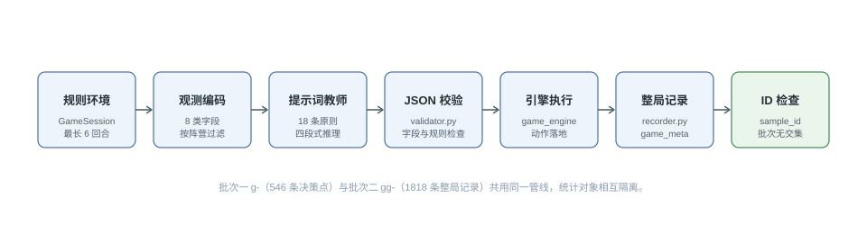
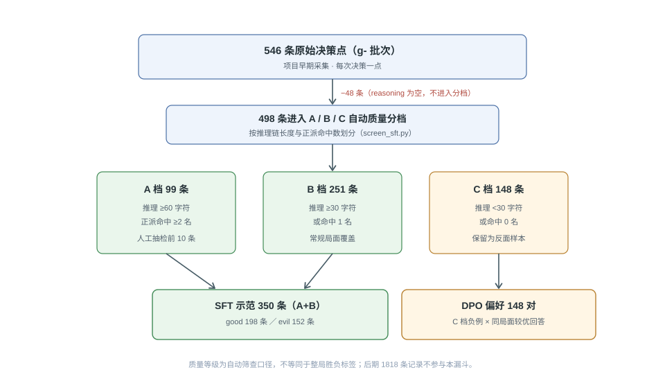

# 第四章 对局数据采集与处理

《幸せの糸》的微调数据不是从通用问答语料中截取，而是由智能体在真实规则环境中逐回合产生。`prompts.py`规定角色目标和决策原则，`state_encoder.py`把棋盘转换为受限观测，`recorder.py`再保存模型的推理、动作与对局结果。该流程中，提示词工程承担“教师”角色：它先把玩家经验转成可执行的决策范式，再由提示词版 `deepseek-chat` 生成示范，供后续350条SFT样本和148对DPO偏好数据使用。

## 4.1 提示词体系设计

### 4.1.1 双角色设定与18条决策原则

正派和反派面对同一张5×5棋盘，但信息条件与胜利目标相反。`GOOD_SYSTEM_PROMPT`要求正派在不知道3名反派身份的条件下，根据死亡标记、历史监视和贝叶斯信念选择3个目标；`EVIL_SYSTEM_PROMPT`则向反派开放完整身份，使其在5张行动卡的约束下放置死亡标记并控制身份暴露。两套提示词分别约束“找出反派”和“隐藏反派”，避免使用一套通用指令处理两个方向相反的任务。

正派侧设置P1～P8共8条领域原则，另以P0“信念优先”作为执行总则。P0要求默认直接选择 `belief.top5_suspects` 中概率最高的3个对象，只有钓鱼实验、目标已被排除等明确理由才能替换。P1～P8进一步覆盖标记范围、范围交叠、次数反推、钓鱼实验、跨回合交集、死亡排除、第五回合钓鱼位和全局一致性检查。例如P3规定：“若实际标记数k小于卡牌容量c，则当轮3个监视对象中恰有 `3-k` 名反派。”这条原则把公开的行动数量转成可复核的身份约束，而不是让模型只凭语言直觉猜测。

反派侧设置R1～R10共10条反制原则。R1要求优先选择能够容纳更多无辜者的影响范围，以稀释正派的嫌疑集合；R2按存活反派数量安排卡牌使用顺序；R3限制同一反派连续行动造成的范围交集；R4～R10分别处理终局歧义、历史解释数量、反清除、诱饵身份、暴露度、重叠规避和第一回合全局计划。由8条正派原则和10条反派原则构成的18原则体系，使提示词不仅描述游戏规则，还规定教师模型应当如何比较候选动作。

18条原则还把零散的玩家经验转换为可重复调用的系统指令。相同 `GOOD_SYSTEM_PROMPT` 或 `EVIL_SYSTEM_PROMPT` 会随每个决策点进入训练消息，使350条SFT示范共享同一套角色语义。教师与学生的关系由此落在可检查的数据字段上：教师用原则生成 `reasoning` 和动作，微调模型学习在相同观测协议下复现这种映射，而不是学习某一局固定答案。

### 4.1.2 四段式推理模板

思维链提示通过显式中间步骤组织复杂推理[15]。本项目没有直接照搬数学推理任务的自由文本形式，而是在 `prompts.py` 中把单次决策压缩为“观察到什么→推断出什么→比较哪些方案→最终决定什么”4个语义阶段。当前代码使用一个 `reasoning` 字符串承载这4段内容，并限制正派最多3句、反派最多2句；因此论文不把它表述为4个独立JSON字段。

四段式模板同时承担数据规范作用。观察阶段只能复述编码器允许看到的字段；推断阶段需要关联P1～P8或R1～R10；比较阶段说明候选目标、卡牌或暴露风险；决定阶段必须与结构化动作一致。早期546条决策点中，缺少 `reasoning` 的记录会被 `screen_sft.py` 直接跳过，这说明动作合法并不等于能够作为思维链示范，教师输出还必须保存可检查的决策依据。

### 4.1.3 结构化输出协议

正派输出协议包含 `reasoning`、`confidence` 和 `targets`，其中 `targets` 必须是3个互异且当前可监视的整数编号。提示词中的真实示例把动作写为 `"targets":[401,402,601]`，并用 `confidence:0.85` 表示本轮至少命中1名反派的把握。反派输出包含 `reasoning`、`confidence`、`cardIndex` 和 `actions`；每个动作还必须给出 `villainId`、`targetId` 与 `shape`，动作数等于所选卡牌本轮要求的槽位数。

该协议把自然语言推理与程序动作放在同一条记录中。`confidence` 被限制在0～1，九宫格和十字分别使用 `nine_grid` 与 `cross`，`validator.py`再检查目标存活状态、卡牌可用性、满员行动和影响范围。由此，提示词教师生成的不是只能阅读的分析文字，而是可以被引擎执行、被筛选脚本统计、并能直接转换为ShareGPT训练格式的监督样本。

## 4.2 观测编码方案

### 4.2.1 棋盘视图与历史编码

`encode_observation()`输出 `side`、`round`、`phase`、`board`、`hand_cards_used`、`history`、`belief` 和 `action_space` 8类字段。`board`中的每个位置包含编号、行列、存活状态、死亡标记形状、标记回合和本轮监视状态；正派视图把全部 `role` 写为 `unknown`，反派视图才保留真实身份。历史则按回合压缩为监视目标、死亡标记、卡牌编号和跳过状态，避免把引擎内部对象直接序列化给模型。

`game_meta.villains` 虽然会随 `sample_id` 和随机种子保存在 `recorder.py` 的事后记录中，但该字段不进入正派的 `decision_point`。这种分离同时满足2个用途：训练输入遵守不完全信息边界，筛选程序又能在对局结束后计算正派动作实际命中了几名反派。A/B/C自动分档所需的真实身份来自标注侧元数据，而不是教师模型当时可见的输入。

### 4.2.2 贝叶斯信念与合法动作空间

正派观测中的 `belief.top5_suspects` 最多保存5个候选人及其后验概率，概率在编码时保留3位小数。提示词的P0原则要求优先使用这张热度表，减少模型重复计算5×5棋盘几何关系导致的错误。反派已经知道3名同伴身份，因此其 `belief` 为 `None`，决策重点转为卡牌节奏和暴露风险。

合法动作空间也按阵营分别生成。正派得到 `choose_3_surveillance` 及当前全部候选编号；反派得到 `active_villains`、`available_cards`、`action_count_required`，以及每个形状槽位下不同反派可选择的 `targets_by_villain`。例如一个需要2次行动的卡牌会生成2个有顺序的槽位，模型只需在程序已经枚举的目标集合中组合策略，不必自行判断十字或九宫格是否覆盖行动者。

从数据结构看，1条训练输入可用以下8类字段概括：

```json
{
  "side": "good",
  "round": 5,
  "board": ["25个经过阵营过滤的位置"],
  "history": ["第1回合至当前回合的公开事件"],
  "belief": {"top5_suspects": [{"id": 401, "prob": 0.312}]},
  "action_space": {"type": "choose_3_surveillance", "candidates": [201, 202, 203]}
}
```

该示例只展示字段结构，不冒充1818条记录中的某一条实测样本。实际构建时，`build_sft.py`将系统提示词、观测JSON和教师回答依次写成 `system/user/assistant` 3条消息，使训练阶段与推理阶段使用相同的输入输出协议。

## 4.3 对局数据采集与批次隔离

`recorder.py`在真实 `GameSession` 规则下推进最长6回合对局。每个正派阶段先保存公开棋盘、历史、信念和合法监视目标，再调用提示词版 `deepseek-chat` 或规则AI选择3个对象；每个反派阶段以相同方式保存可用卡牌和合法标记方案。动作经过引擎执行后，胜负、总回合数、双方难度和随机种子写入 `game_meta`，由此形成“受限观测—教师推理—结构化动作—环境反馈”的数据管线。

项目存在2个用途不同的采集批次。批次一使用 `g-` 前缀，共有546条早期决策点，经过筛选后形成350条SFT示范和148条DPO负例。批次二使用 `gg-` 前缀，来自 `games` 与 `games_r810` 各100局完整对局，共200局、1818条整局决策记录；其中good与evil各909条，双方难度均为normal。两批数据的 `sample_id` 没有交集，1818条记录没有混入已报告的350条SFT训练集。

数据隔离首先依赖 `sample_id`：批次一由游戏编号、随机种子、阵营、回合和决策序号组成，批次二由整局 `game_id` 与 `seq` 组成。当前核验能够确认2个批次不存在ID交集，但没有形成基于文本向量的语义去重报告，因此本文只主张“按ID检查无重复与跨批次隔离”，不把相似局面自动描述成已经完成语义去重。数据管线如图4-1所示。



图4-1 对局数据管线（规则环境 → 观测编码 → 提示词教师 → JSON 校验 → 引擎执行 → 整局记录 → sample_id 检查）

## 4.4 自动分档与人工抽检

`screen_sft.py`先排除没有思维链的样本，再按推理长度和正派命中数自动分档。脚本通过Python的 `len(reasoning)` 计算字符数，而不是统计词元。对正派而言，推理不少于60字符且一次选择命中至少2名真实反派时进入A档；推理不少于30字符且命中至少1名时进入B档；推理少于30字符或命中数为0时进入C档。反派没有“命中反派数”这一指标，因此推理不少于60字符进入A档，30～59字符进入B档，少于30字符进入C档。

546条原始决策点中，A档99条、B档251条、C档148条，三档合计498条。剩余48条因为没有 `reasoning`，按照脚本的 `continue` 分支未进入任何等级。A、B两档合计350条，进一步按角色得到good 198条、evil 152条，并作为SFT训练集；C档148条作为拒绝回答，与对应正例构成148对DPO偏好数据。这里的A/B/C只属于 `g-` 批次，不能套用到后期1818条 `gg-` 记录。

该分档中的“质量”是自动筛查口径，不是完整对局胜负的直接标签。正派命中1名或2名反派能够反映当前动作与获胜目标的局部相关性，但 `screen_sft.py` 没有把最终 `winner` 写入判级条件；反派A、B档更只由60字符和30字符阈值决定。因而，A档应解释为“通过较严格自动条件的候选示范”，不能直接等同于必胜决策。

人工核验采用抽检而不是双人审校。`build_sft.py spotcheck --n 10`从A档提取前10条并生成 `spotcheck-top10.md`，由人工逐条查看棋盘、历史、信念、推理链和最终选择。该流程可以发现“文字足够长但原则使用错误”等自动阈值无法识别的问题，但10条抽检不能证明其余89条A档均经过人工复核，因此本文不使用“双人标注”“全量人工审校”或“一致性系数”等没有记录支持的表述。

图4-2把质量处理画成漏斗：546条原始决策点先排除48条无思维链记录，余下498条分为A档99条、B档251条和C档148条；A+B形成350条SFT示范，C档进入148对DPO数据。该漏斗同时说明质量等级与用途的对应关系，避免把后期1818条独立记录误画成分档后的训练集。



图4-2 早期训练数据的质量分档与用途（546 条 → A/B/C 三档 → SFT 350 条与 DPO 148 对）

## 4.5 数据集统计

后期整局批次的角色与难度分布见表4-1。200局均采用normal难度，easy和hard没有训练记录；这2档只在第六章竞技评测中出现，不能据此声称训练数据覆盖3档难度。

| 视角 | easy | normal | hard | 合计 |
|---|---:|---:|---:|---:|
| good | 0 | 909 | 0 | 909 |
| evil | 0 | 909 | 0 | 909 |
| 合计 | 0 | 1818 | 0 | 1818 |

200局由2个100局批次组成，`games` 的对局结果为good 84胜、evil 16胜，`games_r810` 为good 78胜、evil 22胜。表4-2记录早期训练批次的筛选结果；两张表使用不同 `sample_id` 前缀，统计对象不能合并为同一个训练集。

| 处理类别 | 数量 | 角色或判据 | 最终用途 |
|---|---:|---|---|
| 原始决策点 | 546 | `g-` 前缀 | 自动筛查输入 |
| 无思维链 | 48 | `reasoning` 为空 | 不进入分档与训练 |
| A档 | 99 | 高质量推理；正派命中不少于2 | SFT与人工抽检 |
| B档 | 251 | 可用但证据或命中较弱 | SFT |
| C档 | 148 | 推理过短或正派命中为0 | DPO负例 |
| SFT合计 | 350 | good 198、evil 152 | 监督微调 |

字段层面，546条决策点均围绕 `sample_id`、`game_meta`、`decision_point` 和 `ai_label` 组织；进入训练的记录再转为3消息ShareGPT结构。现有核验资料只提供30字符、60字符两处分档阈值，没有给出平均词元数、长度中位数或P95，因而本章不补造样本长度均值，而以字段完整性、48条缺失思维链和A/B/C数量作为可复核统计。

## 4.6 数据扩充中的经验与修正

早期350条SFT示范完成训练后，结果未达到预期，项目随后采集200局、1818条整局决策记录，用于扩大双视角对局资产。两者不是同一批数据的简单增补：350条来自早期546条决策点的A+B筛选，1818条来自后期 `games` 与 `games_r810`，两批没有ID交集，且当前已报告的双底座训练仍使用350条SFT和148对DPO数据。论文因此不能写成“1818条全部分档后只取A档训练”。

第二项修正是把“有动作”与“有教学价值”分开。546条中有48条缺少推理链，虽然其中部分动作可能可执行，仍不能承担四段式思维链的监督作用；C档148条也没有被直接丢弃，而是作为较差回答参与偏好构造。该处理使SFT学习“如何按协议决策”，DPO再利用148对数据学习同一观测下何种回答更符合角色目标。

第三项修正是限制结论范围。1818条记录的good与evil视角完全平衡，但全部来自normal难度；两个100局批次的胜负分别为84:16和78:22，也说明数据中的结果类别并不均衡。后续若将该批次纳入训练，需要先按完整 `game_id` 划分训练、验证和测试集合，并检查角色、胜负及局面重复，不能把同一局的不同回合拆到不同集合中造成信息泄漏。

## 4.7 本章小结

本章给出了《幸せの糸》数据生产的实际结构。`prompts.py`以8条正派原则、10条反派原则和4段式推理规定教师模型的决策方式，`state_encoder.py`用8类字段控制信息边界并预先枚举合法动作，`recorder.py`再把每次决策与最长6回合的环境反馈连接起来。提示词工程由此成为可执行的数据生产器，而不只是提高单次回答效果的输入技巧。

训练数据与后期数据资产必须分别解释：早期546条决策点中有498条进入A/B/C分档，A+B共350条用于SFT，C档148条用于DPO；后期1818条记录来自200局normal对局，good与evil各909条，与训练批次没有ID交集。第五章将在这一数据口径上说明350条SFT、148对DPO以及两个底座的QLoRA训练实现。
