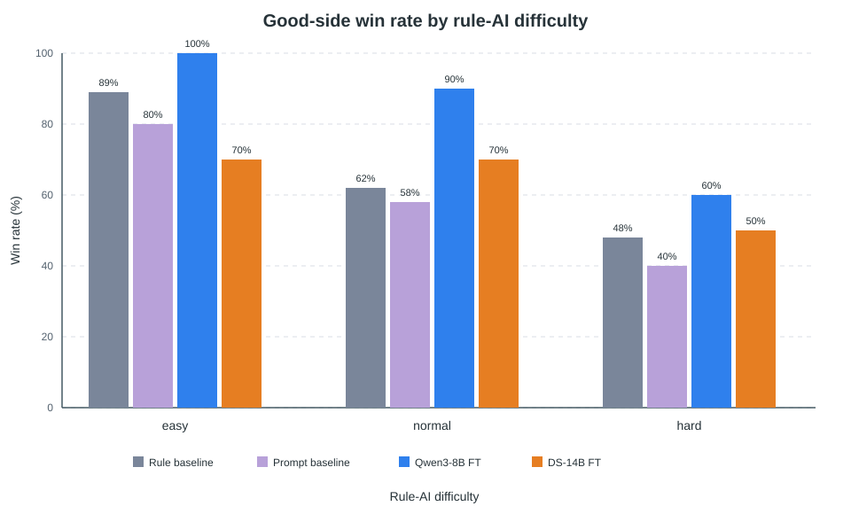

# 第六章 实验与分析

第五章在相同的350条SFT示范、148对DPO偏好数据和rank 16 QLoRA方案下训练了Qwen3-8B与DeepSeek-R1-Distill-Qwen-14B。本章不以单一胜率判断模型，而是把真实模型调用、动作合法性、完整对局结果和部署可用性分层记录。实验覆盖正派与反派2种角色、easy/normal/hard 3档规则对手，并把两次“规则兜底成绩混入模型成绩”的事故纳入评测制度设计。

## 6.1 分层评测体系设计

### 6.1.1 L0～L3四层标准

AgentBench把大语言模型智能体置于8类交互环境中，强调多轮决策、指令遵循和环境反馈共同决定任务是否完成[2]；Arcade Learning Environment则通过统一接口、固定环境和可重复对局支持智能体间比较[1]。参照这2类范式，本项目没有采用主观的语言流畅度评分，而是建立表6-1所示的L0～L3标准。层级顺序具有前置关系：L0不通过时不能计算L1，L1不通过的动作不能计入L2，L2成立也不等于L3的人类体验已经得到验证。

| 层级 | 评测对象 | 核心指标与判定 | 本章状态 |
|---|---|---|---|
| L0 调用真实性 | 模型是否实际接入游戏链路 | LLM调用次数必须大于0；记录所用角色、底座、难度与后端；纯`RuleBrain`结果不得署名为模型成绩 | 已执行，并作为成绩有效性前提 |
| L1 动作合法性 | 模型能否输出可执行动作 | JSON可解析、字段完整、目标与卡牌合法；报告合法率、重试与回退率；批次回退率大于5%作废 | 已执行，合法率92%～100% |
| L2 竞技能力 | 合法动作能否转化为角色目标 | 正反派分别对easy、normal、hard进行完整对局；报告胜率与正派单决策命中数 | 已执行，每档模型实验10局 |
| L3 人类体验 | 延迟、可理解性与真实玩家感受 | 需用户研究量表、任务完成时间和主观体验数据 | 尚未启动，不在本章声称完成 |

L0是两次假数据事故后新增的身份检查。事故中，LLM未被真正调用或调用失败后由`RuleBrain`完成动作，但最终胜负仍被汇总进“模型胜率”。如果只看完整对局是否结束，这类数据会显得稳定，实际测量对象却已从微调模型变成规则系统。因此，当前批次除模型名与难度外，还必须确认LLM调用次数大于0；调用次数为0的批次直接作废，不进入表6-4与表6-5。

L1设置回退率大于5%的红线，是为了进一步排除“模型参与了调用、主要成绩却由规则兜底产生”的情况。回退率按规则脑接管的决策数除以智能体总决策数计算；即使回退动作合法并最终获胜，也不能当作模型独立完成。红线不是模型能力阈值的行业标准，而是本项目在2次污染事故后制定的内部质量控制规则。

### 6.1.2 指标定义与解释边界

L1合法率按`eval.py`口径统计一次生成或携错重试后由模型给出合法动作的决策比例，回退到`RuleBrain`的决策单独计入回退率。L2胜率为某角色获胜局数除以该设置下完整对局数；正派单决策命中数则在每次选择3名监视对象后，统计其中真实反派的数量，取值范围为0～3。提示词基线的该指标为1.88，它描述目标识别质量，不能写成188%或等同于整局胜率。

本章只做描述性比较，不对每档10局结果进行显著性外推。规则基线为100局/格工程基准，与模型组10局/档非等局数，仅作数量级参照。表6-4保留89%、62%、48%这3个已核验百分比，但不声称规则基线与模型组已经满足严格的同局数统计检验。

## 6.2 实验设置

竞技实验以规则AI作为固定对手，并按easy、normal、hard 3档改变其搜索和决策强度。每个微调模型分别扮演正派和反派，每个角色在每档进行10局，模型组共形成2个底座×2种角色×3档的实验矩阵。正派、反派使用同一`state_encoder.py`观测编码、同一`llm_gateway.py`调用接口和同一`validator.py`动作校验，避免因输入字段或执行规则不同造成额外差异。

| 控制项 | 统一设置 | 变化项 |
|---|---|---|
| 训练数据 | SFT 350条、DPO 148对 | 无 |
| 微调方法 | 4bit NF4、双重量化、LoRA rank 16、全线性层投影 | 底座为8B或14B |
| 角色 | 分别测试good与evil | 角色目标与可见信息不同 |
| 对手 | 规则AI | easy、normal、hard 3档 |
| 对局数 | 微调模型每设置10局 | 规则基线为100局/格工程基准，与模型组10局/档非等局数，仅作数量级参照 |
| 输出协议 | 角色对应JSON，经`validator.py`检查 | 正派输出3个目标，反派输出卡牌与行动 |

2个微调底座之间保持相同观测编码、JSON协议与游戏引擎；`RuleBrain`只共享游戏规则、角色与难度语义，不经过LLM观测编码和JSON生成。因此，规则成绩是工程基线而不是严格同构的模型对照，提示词基线才是与微调模型最接近的协议对照。

训练数据全部来自normal难度，easy和hard只在评测时出现。因而，easy结果主要检查低压力条件下能否稳定执行协议，normal结果最接近训练分布，hard结果则观察难度变化后的表现。该设计可以检验难度迁移，但不能证明模型已经跨游戏泛化；350条SFT和148对DPO仍只来自《幸せの糸》单一领域。

评测记录同时保存胜负、LLM调用、格式解析、规则校验、携错重试和规则回退。正反角色采用同一套记录口径，但胜率不能脱离角色解释：正派需要从隐藏信息中同时锁定3名反派，反派知道身份却要安排5张一次性行动卡并控制暴露。第5章提出的“规模—角色适配不对称”假设，必须在2个角色中分别验证，而不能先对6个设置求一个总平均再下结论。

## 6.3 L1动作合法性结果

最终有效批次的L1合法率落在92%～100%，回退率落在0%～8%；其中Qwen3-8B在正反角色和3档难度下的合法率均为100%。这说明8B适配器已经较稳定地学习了正派`targets`以及反派`cardIndex/actions`协议。DeepSeek-R1-Distill-Qwen-14B的有效记录仍出现低于100%的单元格，但最新版`data.md`只保留92%～100%的总体范围，没有保存可供论文引用的逐角色、逐难度6格明细，表6-3据此不补造具体百分比。

| 模型或批次 | L1合法率 | 回退率 | 处理结果 |
|---|---:|---:|---|
| Qwen3-8B全部有效档位 | 100% | 未保存逐档明细 | 纳入L2比较 |
| DS-14B其余有效档位 | 92%～100%范围内 | 未保存逐档明细 | 纳入L2比较；逐档值待成绩单回查 |
| DS-14B反派easy首轮 | 未作为最终成绩采用 | 8% | 超过5%红线，整批作废 |
| DS-14B反派easy补跑 | 有效 | 0% | 胜率100%，纳入L2比较 |

红线在14B反派easy首轮被实际触发：该轮回退率为8%，不是在论文整理阶段删除几个失败动作，而是整批成绩作废后重新运行。补跑批次回退率降为0%，对应胜率为100%。这项记录说明“最终动作可执行”不足以证明模型有效，因为8%的决策已经由`RuleBrain`替代；只有把回退作为批次级否决条件，L2胜率才仍然指向待评模型。

92%～100%的合法率也不能直接解释为策略正确。`validator.py`只能判断3个监视目标是否互异存活、反派卡牌是否可用、动作数与目标范围是否合法；一个完全合法的动作仍可能选择错误嫌疑人或暴露反派身份。L1回答“能否独立行动”，L2才回答“行动是否带来胜利”，2个层级必须同时报告。

## 6.4 L2竞技结果

### 6.4.1 正派视角

正派结果见表6-4。Qwen3-8B在easy、normal、hard分别取得100%、90%、60%，3档均高于规则基线的89%、62%、48%，差值分别为11、28和12个百分点；相对提示词基线80%、58%、40%，差值为20、32和20个百分点。提升在normal档最大，且hard档仍保留60%的胜率，说明最终8B适配器不仅复现了提示词教师，还在3档完整对局上取得了更高的描述性成绩。

| 正派模型 | easy | normal | hard |
|---|---:|---:|---:|
| 规则基线 | 89% | 62% | 48% |
| 提示词基线（deepseek-chat） | 80% | 58% | 40% |
| Qwen3-8B微调 | **100%** | **90%** | **60%** |
| DS-14B微调 | 70% | 70% | 50% |

图6-1 正派视角下规则、提示词与2个微调模型的三档胜率

DS-14B在easy、normal、hard分别为70%、70%、50%。它在normal和hard上比提示词基线高12和10个百分点，但easy低10个百分点；与8B相比，3档分别低30、20和10个百分点。由此可以得出针对本项目的直接结论：参数量更大的14B推理型底座没有在正派任务上形成更高胜率，8B在当前3档均占优。

提示词基线的单决策平均命中数为1.88，说明教师模型每次从3个监视位中平均命中接近2名反派，但该局部指标没有对应的8B、14B同口径数值，不能据此计算微调后的命中增量。当前可以比较的是完整对局胜率；“SFT+DPO分别贡献多少”也无法从表6-4分离，因为尚未完成8B的SFT-only消融。

### 6.4.2 反派视角

反派结果呈现不同排序。Qwen3-8B的easy、normal、hard胜率为100%、20%、20%，DS-14B为100%、50%、10%。14B在easy与8B持平，在normal高30个百分点，在hard反而低10个百分点；按3档不加权平均，14B为53.3%，8B为46.7%，但这一平均只用于描述趋势，不能掩盖hard档的反向结果。

| 反派模型 | easy | normal | hard |
|---|---:|---:|---:|
| 规则基线 | 约16% | 约22% | 约22% |
| Qwen3-8B微调 | **100%** | 20% | **20%** |
| DS-14B微调 | **100%** | **50%** | 10% |

反派规则基线约为16%、22%、22%，只作为数量级参照。8B在easy显著高于该基线，在normal与hard接近基线；14B在easy和normal更高，在hard低于约22%的规则结果。由于每个模型单元格只有10局，100%对应10胜、10%对应1胜，单局波动即可改变10个百分点，因而不能把normal档的30个百分点优势外推成所有难度上的稳定优势。

## 6.5 规模—角色适配不对称验证

第五章将“规模—角色适配不对称”定义为待验证假设，本章结果提供了部分支持。正派3档中8B全部高于14B，3档不加权平均分别为83.3%和63.3%，差20.0个百分点；反派3档平均则由8B的46.7%变为14B的53.3%，方向发生反转。该反转表明，在2个具体底座、350条SFT和148对DPO的条件下，模型规模与底座类型没有对2种角色产生同方向收益。

| 比较视角 | Qwen3-8B | DS-14B | 可验证结论 |
|---|---:|---:|---|
| 正派3档平均胜率 | 83.3% | 63.3% | 8B高20.0个百分点 |
| 反派3档平均胜率 | 46.7% | 53.3% | 14B高6.6个百分点，优势来自normal档 |
| 反派easy对手命中数 | 未记录 | 0.38 | 14B在easy隐蔽性较强 |
| 反派normal/hard对手命中数 | 未记录 | 1.62/1.61 | 难度升高后未保持easy表现 |
| 规则反派hard对手命中数 | — | 约0.68 | 14B hard的1.61并不优于该基线 |

反派隐蔽性以对手正派每次监视命中的反派数衡量，越低越好。14B在easy为0.38，normal和hard分别为1.62、1.61；规则反派hard基线约为0.68。该指标并不支持“14B在所有反派设置中都更隐蔽”：0.38只说明easy条件下暴露控制有效，而hard的1.61明显高于约0.68。结合胜率，当前更准确的说法是14B在反派normal档表现出优势，反派侧3档平均略高，但这种优势没有跨难度稳定成立。

一种待后续消融验证的成因假设是，DeepSeek-R1-Distill-Qwen-14B的显式推理倾向可能更适合反派的卡牌节奏、诱饵安排和多步隐蔽规划，因此在normal档把胜率从20%提高到50%；正派任务则更依赖从受限信念表快速选择3个目标，较长推理可能没有转化为更好的动作。另一种假设是训练数据覆盖不均：350条SFT中正派198条、反派152条，148对DPO的局面分布又没有完整归档，2个底座可能对同一小样本产生不同偏置。以上解释均为假设，现有实验没有隔离参数规模、预训练风格、推理长度和样本构成，不能确认为因果机制。

工程部署不应据此简单选择“更大模型”。当前证据支持正派优先部署8B；反派若主要面对normal规则对手，可进一步验证14B，但hard档10%的结果要求保留8B或规则方案作为对照。按角色选择模型比统一使用14B更符合本轮成绩，也能减少在8GB本机加载更大底座的资源压力。

## 6.6 不确定性治理验证

14B最初接入时会在JSON前后输出思维块或散文，使格式合法率降为0%、请求100%回退。问题不在游戏策略，而在生成结果无法进入`validator.py`。`cloud_serve.py`随后加入JSON模式：首token约束输出从“{”开始，生成后提取最短合法JSON，并加固终止符；v5冒烟测试通过后，最终有效批次的L1合法率恢复到92%～100%。0%到可执行区间的变化证明，生成约束是14B进入游戏链路的必要条件。

运行时采用4级容错链路：第1级由推理服务约束JSON生成，第2级由`_parse_json()`解析并由`validator.py`校验规则，第3级把错误原因带回模型并重试1次，第4级仍失败时由`RuleBrain`接管以避免对局卡死。该链路同时服务可用性与可审计性：回退保证对局能继续，`fallback_count`、`retry_count`和`parse_errors`则防止兜底结果再次冒充模型成绩。

现有`data.md`没有保存“发生重试的决策总数”和“重试后成功数”2个分子、分母，因此本章不能给出数值化重试成功率。可以确认的结果只有：8B各档L1合法率为100%，全部有效批次区间为92%～100%，14B反派easy首轮8%回退被作废且补跑降至0%。这3项记录验证了校验、回退红线和补跑制度确实生效，但不能替代独立的重试成功率统计。

## 6.7 自对弈验证

本机RTX 4060 Laptop 8GB上进行了3局Qwen3-8B左右手互搏，正派以2:1获胜，平均每局5.7回合。正派共决策14次，其中1次回退，记录回退率约3.6%；反派决策14次、回退0次。正派与反派决策延迟P50分别为146.9s和159.0s，说明同一8B适配器可以在单卡上交替承担2个角色。

| 指标 | 正派8B | 反派8B |
|---|---:|---:|
| 3局胜负 | 2胜 | 1胜 |
| 决策次数 | 14 | 14 |
| 回退次数 | 1 | 0 |
| 记录回退率 | 约3.6% | 0% |
| 决策延迟P50 | 146.9s | 159.0s |

这3局只能证明双智能体调用链能够完成对局，不能据2:1判断正派长期强于反派。回退率约3.6%也需谨慎解释：若只以正派14次决策为分母，1/14约为7.1%，而`data.md`记录的3.6%对应1次回退除以双方合计28次决策。后续报告应同时给出“分角色回退率”和“全局回退率”，避免同一数字因分母不同产生歧义。

## 6.8 端到端部署性能

2026-09-16完成了桌面版真实游玩验证，链路为Electron桌面App→本机3000端口后端→本机8001端口Qwen3-8B推理服务，硬件为RTX 4060 Laptop 8GB，模型以4bit加载。玩家扮演反派、AI扮演正派时可以完成整局，说明175MB适配器、游戏后端和桌面客户端能够在消费级8GB显存环境中共同工作。

| 环境 | 单步决策耗时 | 结论 |
|---|---:|---|
| 本机RTX 4060 Laptop 8GB首次实测 | 183.0s | 完整链路可用 |
| 同环境重复实测 | 189.8s | 与150～190s稳定区间一致 |
| 云端RTX 4090同模型 | P50 12.4～14.8s | 本机约为云端12倍耗时 |

本机183.0s与189.8s均属于完整思维链决策，而短输出可约5s完成，差距表明延迟主要随生成长度与本机算力共同增长。约12倍的云端差距不是网络接口失效，而是8GB笔记本GPU承载完整推理的代价。当前系统达到了“可完整运行”，但单步超过3分钟时离实时对战有距离，不能用“本地部署成功”替换交互性能结论。

端到端测试还暴露并修复了3个工程问题。第1个问题是安装版桌面客户端读取开发目录下的`config.json`，修复后改读`resources/config.json`，客户端才能连接正确后端。第2个问题是房间默认`aiBackend='rule'`，表面上游戏正常推进，实际模型没有调用；路由层改为由`AGENT_DEFAULT_BACKEND`控制默认值后，L0才能确认使用`agent`。第3个问题是同步LLM调用阻塞后端事件循环，单次183.0s推理期间其他请求会超时；`main.py`改用`asyncio.to_thread()`在线程池执行后，长推理不再占住ASGI事件循环。

| 工程问题 | 可观察后果 | 修复方式 | 评测层级影响 |
|---|---|---|---|
| 配置路径错误 | 安装版连接错误地址 | 读取`resources/config.json` | L0链路不可达 |
| 默认规则脑 | 对局完成但LLM调用为0 | `AGENT_DEFAULT_BACKEND=agent` | L0成绩身份错误 |
| 同步调用阻塞 | 推理期间全站请求超时 | `asyncio.to_thread()` | L3交互可用性下降 |

3项修复说明部署验证不能只检查8001端口是否返回JSON。只有桌面安装包配置、3000端口房间参数、LLM调用计数和事件循环响应同时通过，183.0s与189.8s才代表真实端到端结果，而不是孤立的模型测速。

## 6.9 本章小结

本章按L0～L3评测《幸せの糸》智能体：L0排除了LLM调用为0和规则成绩冒名，L1记录92%～100%的合法率并以大于5%回退率否决污染批次，L2完成2个角色、3档难度的胜率比较，L3人类体验尚未启动。14B反派easy首轮8%回退被整批作废，补跑达到0%回退和100%胜率，表明红线不是形式要求，而是实际改变了成绩采纳结果。

竞技结果验证了第五章假设中的角色反转，但只在限定范围内成立：8B正派3档均高于14B，平均领先20.0个百分点；14B反派3档平均高6.6个百分点，优势主要来自normal档的50%对20%，hard档仍以10%落后于8B的20%。因此，“规模—角色适配不对称”是2个具体底座在本项目中的实验发现；推理风格、训练样本覆盖等成因仍是假设，不能写成已证实机制。

部署侧完成了RTX 4060 Laptop 8GB端到端真实游玩，单步为183.0s与189.8s，而RTX 4090为12.4～14.8s，约存在12倍差距。系统已经具备完整功能，但分钟级延迟、自对弈仅3局、规则基线为100局/格工程基准且与模型组10局/档非等局数、14B逐档L1明细缺失以及SFT-only消融未完成，构成第七章必须保留的结果边界。
